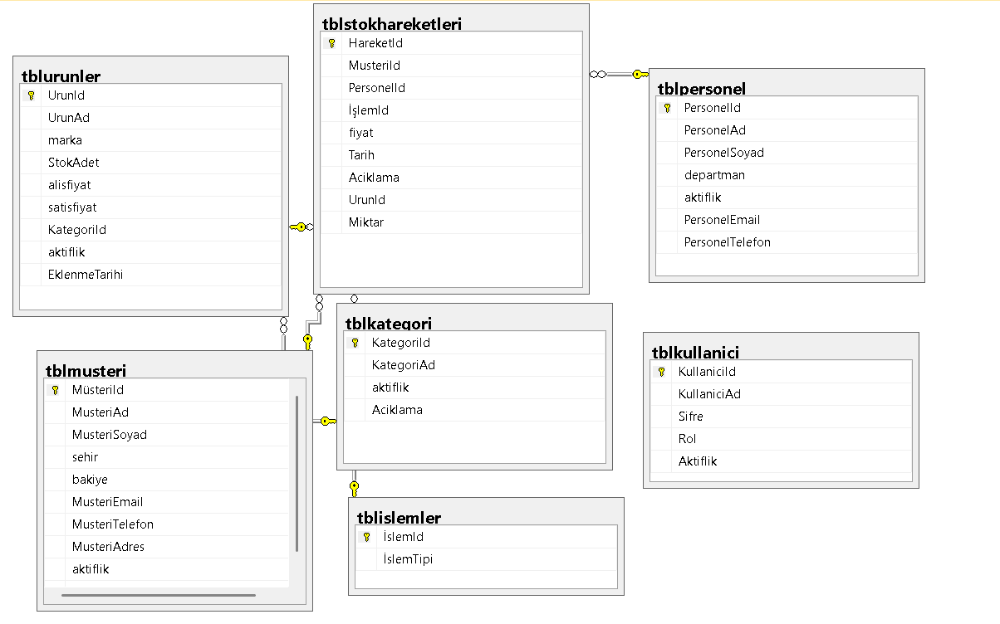
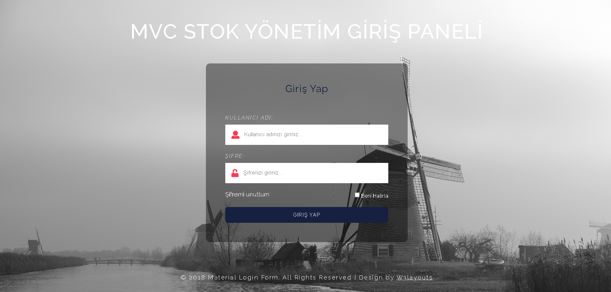
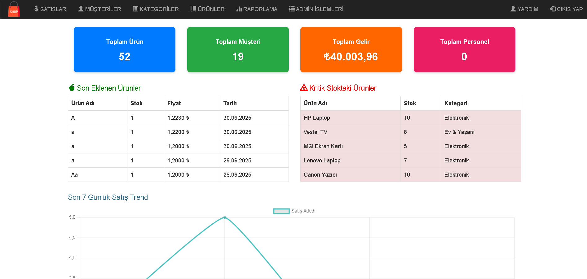
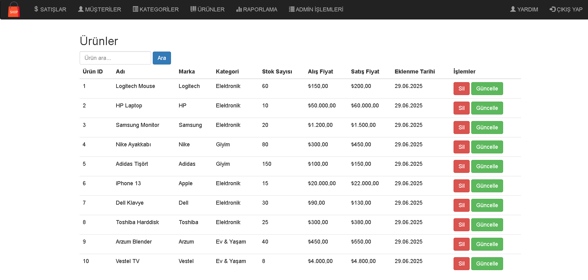
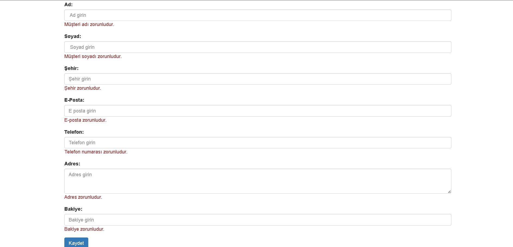
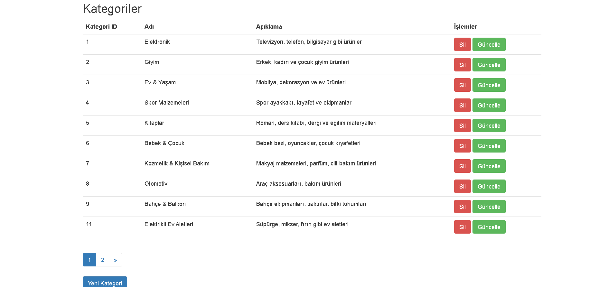

# ASP.NET MVC Stok Takip Uygulaması

Bu proje, **ASP.NET MVC 5** konusunda pratik yapmak amacıyla geliştirilmiş bir stok takip sistemidir. Uygulamada temel olarak kategori, ürün, müşteri ve personel yönetimi ve stok hareketlerinin takibi yapılabilmektedir. 

## 🚀 Temel Özellikler

✅ Kategori, ürün, müşteri ve personel yönetimi  
✅ SQL Server üzerinde **Entity Framework (Database-First)** yaklaşımı  
✅ Bootstrap ile responsive ve kullanıcı dostu arayüz  
✅ Form doğrulama (validation) ile güvenli veri girişi  
✅ Sayfalama desteği (`PagedList.Mvc`) ile uzun listelerde performanslı gezinme  
✅ Soft delete desteği (aktiflik kontrolü ile silme)  
✅ `@Html.*For` HTML Helpers ile temiz ve okunabilir Razor yapısı  

---

## 🛠️ Kullanılan Teknolojiler

| Teknoloji | Açıklama |
|----------|----------|
| ASP.NET MVC 5 | Web uygulama çatısı |
| Entity Framework 6 | ORM katmanı (Database First) |
| SQL Server | Veritabanı |
| Bootstrap 3 | UI tasarımı |
| Razor View Engine | Dinamik sayfa render işlemleri |
| PagedList.Mvc | Sayfalama (pagination) desteği |
| jQuery + jQuery Validate | Form doğrulama için JavaScript kütüphaneleri |

---

## 🗃️ Veritabanı Tasarımı

Aşağıdaki tablolar kullanılmıştır:

- **Kategoriler:** KategoriId, KategoriAdi, Aciklama
- **Ürünler:** UrunId, UrunAdi, KategoriId, StokAdet, BirimFiyat, Barkod, EklenmeTarihi
- **Müşteriler:** MusteriId, Ad, Soyad, Email, Telefon, Adres
- **Personeller:** PersonelId, Ad, Soyad, Email, Telefon, Pozisyon, AktifMi
- **StokHareketleri:** HareketId, UrunId, Miktar, Tarih, PersonelId, Aciklama, HareketTipi

## 📸 Ekran Görüntüleri

# Veritabanı


# Giriş Paneli


# Dashboard İstatistikler Paneli


# Ürünler


# Müşteri Ekleme Ekranı 


# Ürün Kategorileri



## ⚙️ Kurulum Adımları

1. Bu projeyi indir veya klonla:

   ```bash
   git clone https://github.com/sulemese/ASP.NET-MVC-STOK.git

## NOTLAR
Proje tamamen örnek ve eğitim amaçlı geliştirilmiştir.
